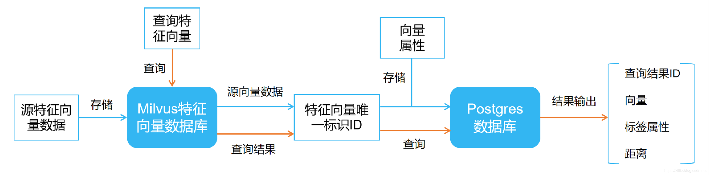

# 基于 Milvus 实现向量与结构化数据混合查询

## 概述

通过深度学习的神经网络模型，可以将图片、视频、语音、还有文本等非结构化数据转换为特征向量。除了结构化的向量，这些数据往往也需添加其他属性。如人脸图片，可以添加性别、是否戴眼镜、图片抓取时间等标签；文本可以添加语言类型、语料分类、文本创建时间等标签。

以往，人们通常将特征向量存入结构化的标签属性表。但**传统数据库**无法针对海量、高维特征向量进行有效的搜索。这时就需要一个**特征向量数据库**，用来高效存储、检索特征向量。

## 解决方案

Milvus 是一款向量搜索引擎，可以轻松实现针对海量向量的高性能检索。结合传统关系型数据库如 PostgreSQL ，用其存储 Milvus 对向量的唯一标识 ID 和向量的对应属性。将 Milvus 向量检索结果，在 PostgreSQL 中进一步查询，就能快速得出混合查询结果，具体解决方案如下：


**特征向量存储**

上图蓝色实线表示了 Milvus 混合查询的特征向量存储过程。首先，将源特征向量数据存入 Milvus 特征向量数据库，Milvus 会给返回每个源向量数据对应的 ID 。然后将每个特征向量的唯一标识 ID 与其标签属性存储至关系型数据库，如 PostgreSQL ，至此完成特征向量与标签属性的存储。

**特征向量检索**

上图橙色实线表示了 Milvus 混合查询的特征向量检索过程。向 Milvus 中传入需要查询的特征向量数据，Milvus 会得出与搜索向量相似度最高的查询结果 ID ，利用该结果 ID 到 PostgreSQL 中进行查询，最终得出检索向量的混合查询结果。

## Milvus 混合查询

至此，你可能会有疑问，为什么不直接将特征向量和对应属性存储在关系型数据库中呢？接下来将用 Milvus 对 [ANN_SIFT1B](http://corpus-texmex.irisa.fr/) 中的一亿数据进行测试，为你解答，[参考链接](https://github.com/milvus-io/bootcamp/blob/master/solutions/hybrid_search/readme.md)。

**1. 特征向量数据集**

本次实现的 Mivus 混合查询，其特征向量提取自 [ANN_SIFT1B](http://corpus-texmex.irisa.fr/) 中 Base Set 文件中的一亿数据（ 128 维）。特征向量检索时从 Query set 中提取，假定 ANN_SIFT1B 数据集为人脸特征向量，并为每个向量添加性别、是否戴眼镜、图片抓取时间的标签：

```bash
# 提取 Base Set 文件中的一亿数据,以用于导入 Milvus
vectors = load_bvecs_data(FILE_PATH,10000000)

# 为向量随机生成性别、是否戴眼镜、图片抓取时间标签
sex = random.choice(['female','male'])
get_time = fake.past_datetime(start_date="-120d", tzinfo=None)
is_glasses = random.choice(['True','False'])
```

**2. 特征向量存储**

将一亿数据导入 Milvus ，其返回的 ids 是向量对应的唯一表示 ID ，将 ids 与向量的标签存入 PostgreSQL ，当然，原始特征向量也可以存入 PostgreSQL （可选）：

```bash
# 将一亿原始数据导入 Milvus
status, ids = milvus.add_vectors(table_name=MILVUS_TABLE, records=vectors)

# 将 ids 与向量的标签存入 PostgreSQL
sql = "INSERT INTO PG_TABLE_NAME VALUES(ids, sex, get_time, is_glasses);"
cur.execute(sql)
```

**3. 特征向量检索**

向 Milvus 中传入需要搜索的向量。设定 `TOP_K` = 10 以及 `DISTANCE_THRESHOLD` = 1 （可根据需求修改）， `TOP_K` 表示搜索与查询向量相似度最高的前 10 个结果，`DISTANCE_THRESHOLD` 表示查询向量与搜索结果向量的距离阈值。

ANN_SIFT1B 中采用欧氏距离计算，参数设定后 Milvus 将返回查询结果的 ids ，利用该 ids 到 PostgreSQL 中进行查询，最终混合查询结果。

```bash
# 根据 query_location 从 Query set 中提取需要搜索的向量
vector = load_query_list(QUERY_PATH,query_location)
# 向 Milvus 中传入需要搜索的向量 vectors
status, results = milvus.search_vectors(table_name = MILVUS_TABLE,query_records=vector, top_k=TOP_K)

# 利用 Milvus 返回的 results.ids 到 PostgreSQL 中进行查询
sql = "select * from PG_TABLE_NAME where ids = results.ids ;"
cur.execute(sql)
```

在对一亿数据进行混合查询时， Milvus 特征向量搜索仅需 70 ms ，在 PostgreSQL 中对 Milvus 搜索结果的 ids 进行查询不超过 7 ms 。

总的来说，利用 Milvus 特征向量数据库，可以快速实现向量与结构化数据的混合查询。若仅使用传统的关系型数据库进行向量查询，不仅大规模向量数据存储难，而且无法高性能完成特征向量检索。

| Milvus 特征向量搜索时间 | PostgreSQL 搜索ids时间 |
| ----------------------- | -------------------- |
| 70 ms                   | 1 ms ~ 7 ms          |

## 总结

本示范实现了基于 Milvus 的混合查询。在一亿特征向量数据集的情况下，混合查询时间不超过 77 ms 。

并且基于 Milvus 易管易用的特性，通过参考 [ Milvus 混合查询方案](https://github.com/milvus-io/bootcamp/tree/master/solutions/hybrid_search) 所提供的工具，能轻松实现向量和结构化数据的混合查询，更好的支持业务需求。

Milvus 正在建设线上开发者社区，如果对 Milvus 的技术讨论和试用感兴趣，欢迎加入我们的 [Slack 频道](https://milvusio.slack.com/join/shared_invite/enQtNzY1OTQ0NDI3NjMzLWNmYmM1NmNjOTQ5MGI5NDhhYmRhMGU5M2NhNzhhMDMzY2MzNDdlYjM5ODQ5MmE3ODFlYzU3YjJkNmVlNDQ2ZTk)，进群沟通。

